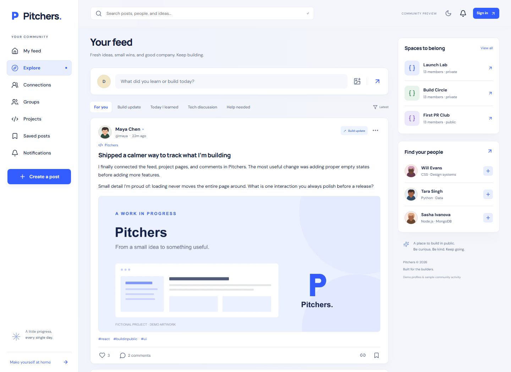

# Pitchers

A developer community for sharing projects, learning in public, and getting unstuck. React + classic JavaScript/Express + MongoDB, in one modular application. Previously Codeial; the existing Git history and repository name are preserved.


## Run locally

Requires Node.js 24 LTS and npm. Open this repository in VS Code.

```sh
npm ci
npm run dev
```

Open http://localhost:5173. The API runs on port 4000. On first run, the local launcher downloads and starts an actual MongoDB process, persists its data under ignored .local/db, and seeds the fictional community. No database account is needed for this local path. Allow the first download to complete.

Choose **Sign in → Explore as Maya** or **Explore as Alex** to try the demo. Normal registration works locally; verification and password-recovery messages are written to .local/mail rather than sent externally. There are no published account passwords.

To use an existing MongoDB instance, copy .env.example to .env and set MONGODB_URI. Seeding only runs automatically for databases whose names end in _demo. Real user data is never reset by ordinary startup.

On Windows, run npm.cmd if a PowerShell execution policy blocks npm.ps1. Restart VS Code after installing Node.js so a new terminal picks up its PATH.

## What is implemented

- Accounts, secure sessions, profiles, avatars, password recovery, and email verification.
- Four post types: build update, learning, discussion, and help.
- Text, images, Markdown/code snippets, comments/replies, likes, private bookmarks, and share links.
- Independent follows and mutual friendships, with request/accept/decline/cancel/remove flows.
- Public and approval-only private groups, member/moderator/owner roles, moderation, and ownership transfer.
- Project showcases with screenshot galleries and linked build updates.
- Help requests with an author-selected solution and open/resolved state.
- Paginated Home/Explore feeds, search and filters, notifications, and live notification refresh.
- Reporting, blocking, and an administrator report queue.
- Responsive light/dark UI, keyboard navigation, and reduced-motion support.

The backend checks authorization for direct API requests, saved items, notifications, and images. A saved reference never grants extra access. Removing private-group membership prevents subsequent protected-image requests; files already downloaded cannot be recalled.

Private messaging, video, stories, AI features, and recommendation algorithms are outside this release.

## Commands

| Command                                          | Purpose                                                                          |
| ------------------------------------------------ | -------------------------------------------------------------------------------- |
| npm run dev                                      | Start the API, Vite, and optional managed local MongoDB                          |
| npm run build                                    | Build the React production bundle                                                |
| npm run preview:demo                             | Serve the built React bundle from Express with local demo services               |
| npm start                                        | Start Express against configured MongoDB                                         |
| npm run lint                                     | Check JavaScript and JSX                                                         |
| npm test                                         | Run real-MongoDB API and seed integration tests                                  |
| npm run test:e2e                                 | Run desktop/mobile browser journeys                                              |
| npm run check                                    | Lint, API tests, and production build                                            |
| npm run seed:demo                                | Populate a configured dedicated demo database                                    |
| npm run seed:demo:reset                          | Explicitly replace tagged seed records in a dedicated demo database              |
| npm run admin:create -- --username your_username | Promote an existing verified, non-demo account; requires the configured database |

Install the browser for E2E tests once with npx playwright install chromium. CI installs browser system dependencies as well.

## Repository

- client: React, Vite, React Router, TanStack Query, CSS Modules.
- server: Express 5, Mongoose, Argon2, sessions, media/mail adapters, and Socket.IO.
- scripts: local development launcher and repeatable original avatar generation.
- docs: API, deployment, architecture, and portfolio notes.

Production is one Node service serving React and the API on the same origin. Data lives in MongoDB; images live in Cloudinary. The local media/mail adapters are development-only.

See [architecture](docs/architecture.md), [API](docs/api.md), and [deployment](docs/deployment.md).

See [the walkthrough and résumé evidence](docs/portfolio.md) for a short tour and claims supported by this implementation. A public deployment is pending account configuration; no live URL is claimed yet.

See [local verification results](docs/verification.md) for the checks and their limits.



## Demo content

The seed contains 40 fictional developers, eight groups, 20 projects, and 180 posts, with related comments, likes, follows, friendships, and saves. Original SVG avatars and generated vector-based project previews require no third-party photo account.

Maya and Alex are shared demonstration accounts. They can try interactions and create content, but cannot change account credentials or curated seed content. Seeded activity is labelled as demonstration data and must not be described as real users or product traction.

## Project history

The original Coding Ninjas-inspired Express/EJS starter remains in Git history. The current implementation replaces its placeholder screens and routes with a React client and a JSON API while preserving the repository.
