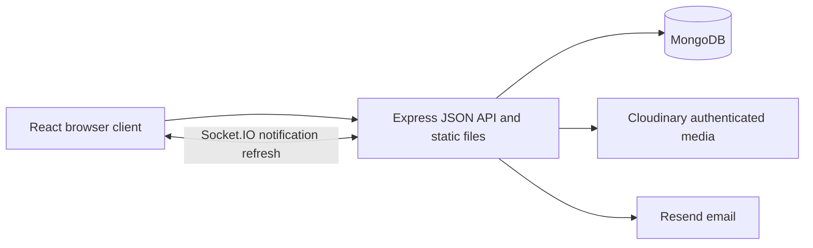

# Architecture

Pitchers is a modular monolith: one Express application, one React client, one MongoDB database, and two external adapters for production media and mail.

## Request and data flow

React Router handles navigation. TanStack Query owns fetched server state and invalidates affected data after mutations. Every mutation includes a session-bound CSRF token. The server validates input, loads the current account, evaluates access, and applies the change.

Models separate content from relationships: users, posts, comments, projects, groups, memberships, follows, friendships, blocks, reactions, bookmarks, reports, media, and notifications. Compound unique indexes make repeated follows, likes, saves, and relationship requests safe. Feed ordering uses timestamps plus ObjectIds as a stable cursor.

The Home feed combines friends, followed authors, and joined groups. Explore exposes readable public posts. Membership grants group access, friendship grants friends-only access, and a follow only changes feed selection. Blocking takes precedence over ordinary interaction. Moderator access is narrowly retained for group moderation.

## Sessions and notifications

Argon2 hashes passwords. Sessions live in MongoDB and use HttpOnly cookies. Production cookies are secure and same-site; write requests validate CSRF and origin. Password reset uses a hashed, expiring, single-use token and invalidates previous sessions.

Socket connections authenticate the same session. Notifications persist in MongoDB, so reconnecting clients reload unread state. Socket payloads trigger a refetch instead of transmitting private post contents. Notification previews are rebuilt with current authorization.

## Media

Uploads are decoded and re-encoded rather than trusting their filename or browser MIME type. Only stored media identifiers are accepted when attaching an image to a post, project, or avatar. An image cannot be bound to both a post and project; screenshot removal and project deletion revoke its public access.

The browser receives an application media URL. Express checks current ownership/content visibility before streaming the file. Restricted responses use no-store. Cloudinary authenticated origin URLs and signatures are never returned to the client.

Development stores files in .local/uploads and mail in .local/mail. Production must use the external adapters, so application redeploys do not erase uploads.

A production guest/demo preview can run before Resend is configured when public registration is disabled. Recovery reports email as unavailable until the key and verified sender are configured.

## Tradeoffs and operating limits

This first release runs as one application instance. API throttles are process-local; multiple application replicas would require shared throttling and a Socket.IO adapter. MongoDB access checks currently favor clarity over extremely large feed throughput; measure query behavior before expanding the dataset.

The managed development database is a real MongoDB process with local persistence, not a mock implementation. Automated tests use separate ephemeral databases. Hosted MongoDB, Cloudinary access, and actual Resend delivery must be verified in the deployment account before calling the cloud release tested.
